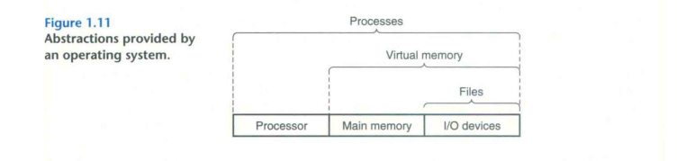
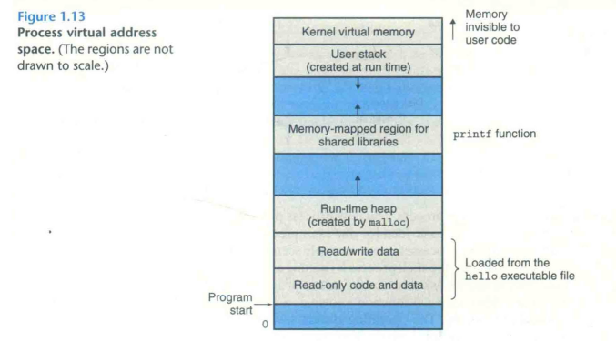
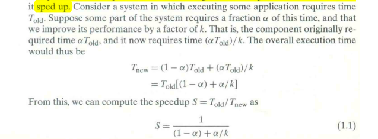
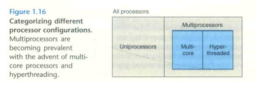

Computer System: A Programmers's Prespective.
==============================================

Preface
********
* a builder’s perspective, describing how to implement the hardware or the systems software, including the operating system, compiler, and network interface.
* a programmer’s perspective, describing how application programmers can use their knowledge of a system to write better programs.
* Arithmetic overflow is a common source of programming errors and security vulnerabilities, yet few other books cover the properties of computer arithmetic from a programmer’s perspective.
* [in the machine-level representation of programs] One certain benefit is that you will develop a thorough and concrete understanding of pointers.
* To this point, you have relied on a conceptual model of the memory system as a linear array with uniform access times.
* Finally, we show you how to improve the performance of application programs by improving their temporal and spatial locality.
* introducing the general concept of exceptional control flow (i.e., changes in control flow that are outside the normal branches and procedure calls).We cover examples of exceptional control flow that exist at all levels of the system, from low-level hardware ex- ceptions and interrupts, to context switches between concurrent processes, to abrupt changes in control flow caused by the receipt of Linux signals, to the nonlocal jumps in C that break the stack discipline.
* Few of our students would have the opportunity to build a computer system. On the other hand, most students, including all computer scientists and computer engineers, would be required to use and program computers on a daily basis
* Topics such as machine language were in; but instead of focusing on how to write assembly language by hand, we would look at how a C compiler translates C con- structs into machine code, including pointers, loops, procedure calls, and switch statements.
* The labs are available from the CS:APP Web page

Chapter 1: A Tour of Computer Systems
**************************************
* Compilation System:

    * Pre-processor: The preprocessor (cpp) modifies the original C program according to directives that begin with the ``#`` character. The result is another C program, typically with the ``.i`` suffix. 
    * Compiler: The compiler (cci) translates the text file hello. i into the text file hello. s, which contains an assembly-language program. Assembly language is useful because it provides a common output language for different compilers for different high-level languages. For example, C compilers and Fortran compilers both generate output files in the same assembly language. (hello.s)
    * Assembler: the assembler (as) translates (hello.s) into machine-language instructions, packages them in a form known as a **relocatable object program**, and stores the result in the object file (hello.o).
    * Linker: The linker (id) handles this merging (merging printf.o precompiled object file into our program). The result is the hello file, which is an executable object file (or simply executable) that is ready to be loaded into memory and executed by the system.

* Buses: Buses are typically designed to transfer fixed-size chunks of bytes known as **words**. The number of bytes in a word (the word size) is a fundamental system parameter that varies across systems. word size = 8/4 bytes = 64/32 bits
* I/O Devices: Each I/O device is connected to the I/O bus by either a **controller** or an **adapter**.
* Main Memory: PhysicaLly, main memory consists of a collection of dynamic random access memory (DRAM) chips. Logically, memory is organized as a linear array of bytes, each with its own unique address (array index) starting at zero.
* CPU: At its core is a word-size storage device (or register) called the program counter (PC). At any point in time, the PC points at (contains the address of) some machine-language instruction in main memory. A processor appears to operate according to a very simple instruction execution model, defined by its **instruction set architecture**. The register file is a small storage device that consists of a collection of **word-size registers**, each with its own unique name.
* We say that **a processor appears to be a simple implementation of its instruction set architecture**, but in fact modern processors use far more complex mechanisms to speed up program execution. Thus, we can distinguish the processor’s instruction set architecture, describing the effect of each machine-code instruction, from its microarchitecture,
* Using a technique known as **direct memory access** (DMA. discussed in Chapter 6), the data travel directly from disk to main memory. without passing through the processor.
* A system spends a lot of time moving information from one place to another. From a programmer’sperspective, much of this copying is overhead that slows down the “realwork”of the program. Thus. a major goal for system designers is to make these copy operations run as fast as possible.
* As semiconductor technology progresses over the years. this processor—memory gap continues to increase. It is easier and cheaper to make processors run faster than it is to make main memory run faster. (paper: It's the memory, STUPID). Here (Cache) comes, they are implemented with a hardware technology known as **static random access memory** (SRAM).
* The idea behind caching is that a system can get the effect of both a very large memory and a very fast one by **exploiting locality**, the tendency for programs **to access data and code in localized regions**. By setting up caches to hold data that are likely to be accessed often, we can perform most memory operations using the fast caches. application programmers who are aware of cache memories can exploit them to improve the performance of their programs by an order of magnitude.
* The main idea of a memory hierarchy is that storage at one level serves as a cache for storage at the next lower level. On some networked systems with distributed file systems, the local disk serves as a cache for data stored on the disks of other systems.
* The operating system has two primary purposes: 
 
    * (1) to protect the hardware from misuse by runaway applications and 
    * (2) to provide applications with simple and uniform mechanisms for manipulating complicated and often wildly different low-level hardware devices. 
    * The operating system achieves both goals via the fundamental abstractions shown in Figure 1.11: processes, virtual memory, and files. As this figure suggests, files are abstractions for I/O devices, virtual memory is an abstraction for both the main memory and disk 1/0 devices, and processes are abstractions for the processor, main memory, and I/O devices.

* The operating system provides the illusion that the program is the only one running on the system. The program appears to have exclusive use of both the processor, main memory, and I/O devices. The processor appears to execute the instructions in the program. one after the other, without interruption. And the code and data of the program appear to be the only objects in the system’s memory. These illusions are provided by the notion of a process, one of the most important and successful ideas in computer science.
* In either case, a single CPU can appear to execute multiple processes concurrently by having the processor switch among them. The operating system performs this interleaving with a mechanism known as context switching. the transition from one process to another is managed by the operating system kernel.
* Note that the kernel is not a separate process. Instead, it is a collection of code and data structures that the system uses to manage all the processes.
* in modern systems a process can actually consist of multiple execution units, called threads. each running in the context of the process and sharing the same code and global data. Multi-threading is also one way to make programs run faster when multiple processors are available
* Each process has the same uniform view of memory, which is known as its virtual address space. The virtual address space for Linux processes is shown in Figure 1.13.
* Note that addresses in the figure increase from the bottom to the top.

* The virtual address space seen by each process consists of a number of well-defined areas, each with a specific purpose.

    * **Program code and data.** Code begins at the same fixed address for all processes, followed by data locations that correspond to global C variables. The code and data areas are initialized directly from the contents of an executable object file. fixed in size
    * **Heap.** the heap expands and contracts dynamically at run time as a result of calls to C standard library routines such as **malloc** and **free**.
    * **Shared libraries.** Holds the code and data for shared libraries such as the C standard library and the math library
    * **Stack.** the user stack that the compiler uses to implement function calls. Like the heap, the user stack expands and contracts dynamically during the execution of the program. In particular, each time we call a function, the stack grows. Each time we return from a function, it contracts.
    * **Kernel vinual memory.** Application programs are not allowed to read or write the contents of this area or to directly call functions defined in the kernel code. Instead, they must invoke the kernel to perform these operations.

* A file is a sequence of bytes, nothing more and nothing less. Every I/O device, including disks, keyboards, displays, and even networks, is modeled as a file. All input and output in the system is performed by reading and writing files, using a small set of system calls known as Unix I/O. File abstraction provides applications with a uniform view of all the varied I/O devices that might be contained in the system.
* The network can be viewed as just another I/O device. With the advent of global networks such as the Internet, copying information from one machine to another has become one of the most important uses of computer systems. applications such as email, instant messaging, the World Wide Web, FTP, and telnet [Telnet is a network protocol used to virtually access a computer and to provide a two-way, collaborative and text-based communication channel between two machines] are all based on the ability to copy information over a network.
* **Adhaml's Law**: The main idea is that when we speed up one part of a system, the effect on the overall system performance depends on both how significant this part was and how much spedup. This is the major insight of Amdahl’s law— to significantly speed up the entire system, we must improve the speed of a very large fraction of the overall system.

* Throughout the history of digital computers, two demands have been constant driving improvements: (1) we want them to do more (2) and we want them to do faster
* We use the term concurrency to refer to the general concept of a system with multiple, simultaneous activities, and the term parallelism to refer to the use of concurrency to make a system run faster.
* Parallelism can be exploited at multiple levels of abstraction in a computer system. We highlight three levels here, working from the highest to the lowest level in the system hierarchy.
* **(1)Thread-Level Concurrency**: With threads, we can even have multiple control flows executing within a single process. Until recently, most actual computing was done by a single processor, even if that processor had to switch among multiple tasks. This configuration is known as a uniprocessor system.
* Hyperthreading, sometimes called simultaneous multi-threading, is a technique that allows a single CPU to execute multiple flows of control. **It involves having multiple copies of some of the CPU hardware, such as program counters and register files, while having only single copies of other parts of the hardware, such as the units that perform floating-point arithmetic**

* **(2) Instruction-Level Parallelism**: pipelining, where the actions required to execute an instruction are partitioned into different steps and the processor hardware is organized as a series of stages, each performing one of these steps. The stages can operate in parallel, working on different parts of different instructions. Processors that can sustain execution rates faster than 1 instruction per cycle are known as superscalar processors. Most modern processors support supcrscalar operation.
* **(3) Single-Instruction, Multiple-Data (SIMD) Parallelism**: At the lowest level, many modern processors have special hardware that allows a single instruction to cause multiple operations to be performed in parallel. For example, generations of Intel and AMD processors have instructions that can add 8 pairs of single-precision floating-point numbers (C data type float) in parallel. Although some compilers attempt to automatically extract SIMD parallelism from C programs, a more reliable method is to write programs using special vector data types supported in compilers such as (gcc).
* 
